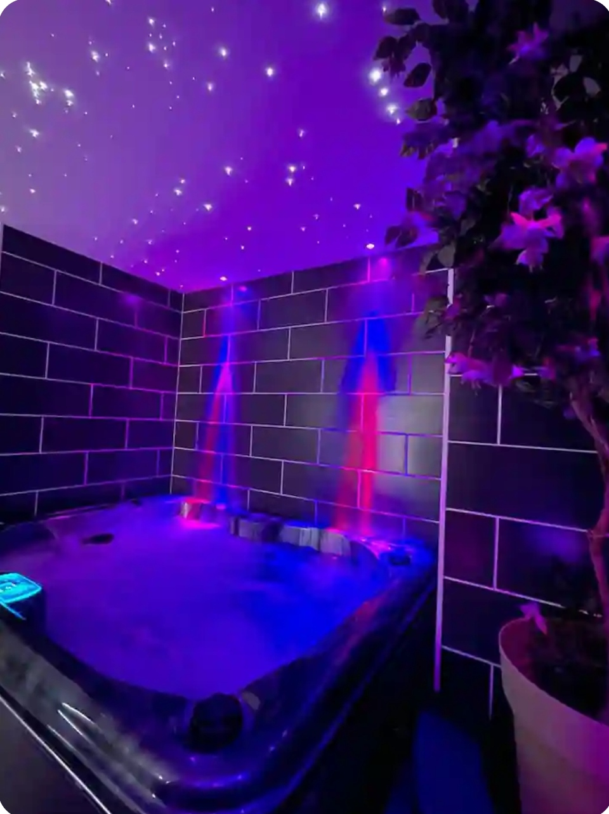

<section>
  <h1>Bienvenue chez <strong>BLŌM</strong></h1>
  
<em>Un moment suspendu entre détente et raffinement.</em>

  

    
    <button id="prev" onclick="changeImage(-1)">‹</button>
    <button id="next" onclick="changeImage(1)">›</button>
  

  

    <strong>BLŌM</strong> est un logement élégant pour deux, avec lit king-size, spa privatif, salle de massage, salon TV et petit déjeuner offert. Idéal pour une escapade romantique en toute autonomie.
  

  

    ✅ Votre jacuzzi est vidé et re-rempli le jour de votre arrivée. Une vidéo vous est transmise pour preuve.
  

  

    href="https://www.airbnb.fr/rooms/985569147645507170" target="_blank" style="display: inline-block; background-color: #ff5a5f; color: black; padding: 12px 24px; border-radius: 8px; font-weight: bold; text-decoration: none; font-size: 16px; margin-bottom: 10px;">
    🔑 Réserver sur Airbnb
  

  <h2>Nos formules à la nuitée ou journée</h2>
  <ul>
    <li><strong>Lundi au jeudi (nuitée) :</strong> 140 euros</li>
    <li><strong>Vendredi (nuitée) :</strong> 170 euros</li>
    <li><strong>Samedi (nuitée) :</strong> 170 euros</li>
    <li><strong>Dimanche (journée ou nuitée) :</strong> 200 euros</li>
    <li><strong>Formule journée (11h - 17h) :</strong> 150 euros</li>
    <li><strong>Formule journée 4H :</strong> 110 euros</li>
  </ul>
</section>

<section class="avis">
  <h2>Avis de nos visiteurs</h2>
  

    
“Parfait ! Parfait ! La vidéo du changement de l’eau avant notre arrivée signe le professionnalisme de ce propriétaire perfectionniste ! Logement impeccable, on avait envie d’y rester... rien à dire à part merci ☺️”" – Pilon, juin 2024 

    
“Séjour inoubliable, tout était impeccable.” – Karim

    
“Le petit déjeuner au lit, un vrai plus !” – Sophie

  

</section>

