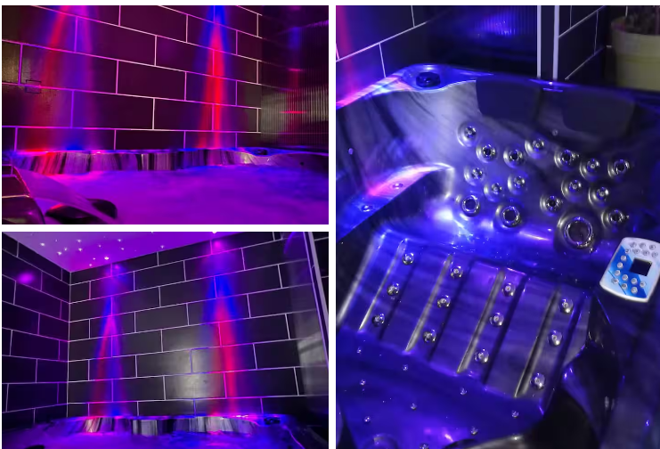

  <a href="/LIVABLOM/" style="background-color: #222; color: white; padding: 10px 20px; border-radius: 6px; text-decoration: none; font-weight: bold; font-size: 14px;">
    Accueil
  </a>

  <h1>BLōM – "Petit dej offert"</h1>
  
Maison d'hôte avec spa privatif, salle de massage, lit King Size et petit déjeuner offert

  
  

    <button onclick="prevImage()" style="background: #333; color: white; padding: 10px 20px; margin-right: 10px; border: none; border-radius: 6px;">⬅️</button>
    <button onclick="nextImage()" style="background: #333; color: white; padding: 10px 20px; border: none; border-radius: 6px;">➡️</button>
  

<section>
  <h2>Le logement</h2>
  
Maison d'hôte avec accès sécurisé par digicode. Au rez-de-chaussée : jacuzzi, salon, salle à manger avec petit frigo et micro-ondes. À l'étage : grande chambre avec lit King Size, salle de massage et salle de douche.

  
Salon avec canapé et TV Netflix. Petit déjeuner offert, servi en toute intimité. Logement non-fumeur (zone fumeurs à l'extérieur).

  
Arrivée et départ en totale autonomie. Jacuzzi vidé et rempli avec vidéo de preuve le jour de votre arrivée.

</section>

<section>
  <h2>Infos pratiques</h2>
  <ul>
    <li>Nombre de voyageurs : 2 maximum</li>
    <li>10 min de Douai et Gayant Expo</li>
    <li>Friterie juste à côté, nombreux restaurants à 5 min</li>
  </ul>
</section>
<section>
  <h2>Nos formules</h2>
  
Découvrez nos différentes offres disponibles à la nuitée ou à la journée, du lundi au dimanche :

  
  <ul>
    <li><strong>Lundi au jeudi (nuitée) :</strong> 140 euros</li>
    <li><strong>Vendredi (nuitée) :</strong> 180 euros</li>
    <li><strong>Samedi (nuitée) :</strong> 180 euros</li>
    <li><strong>Dimanche (journée ou nuitée) :</strong> 200 euros</li>
    <li><strong>Formule journée (11h - 17h) :</strong> 150 euros</li>
    <li><strong>Formule journée 4H :</strong> 110 euros</li>
  </ul>

  
Pour toute réservation ou demande spécifique, contactez-nous directement via WhatsApp ou le formulaire ci-dessous.

</section>

## 💬 Ce que disent nos visiteurs

<section id="avis-clients" style="padding: 40px 20px;">
  

    

      
“Une pépite ! Un hote très sympathique...”

      
– Emilie, mars 2025

    

    

      
“Très bon moment passé...”

      
– Melissa, janvier 2025

    

    

      
“Parfait ! Parfait ! La video du changement de l’eau avant notre arrivée signe le professionnalisme de ce propriétaire perfectionniste ! Logement impeccable on avait envie d’y rester.. rien à dire à part merci ☺️”

      
– Pilon, juin 2024

    

  

</section>

<a href="https://www.airbnb.fr/rooms/985569147645507170" target="_blank" style="display: inline-block; background-color: #ff5a5f; color: black; padding: 12px 24px; border-radius: 8px; font-weight: bold; text-decoration: none; margin-top: 20px; font-size: 16px;">
  🔑 Réserver sur Airbnb
</a>

<a href="https://wa.me/33649831838" target="_blank" style="display: inline-block; background-color: #25D366; color: white; padding: 12px 24px; border-radius: 8px; font-weight: bold; text-decoration: none; margin-top: 10px; font-size: 16px;">
  📲 Réserver via WhatsApp
</a>

<form action="https://formspree.io/f/mrbqrnav" method="POST" style="margin-top: 20px;">
  <label>Nom : <input type="text" name="name" required></label>  
  <label>Email : <input type="email" name="_replyto" required></label>  
  <label>Message : <textarea name="message" rows="4" required></textarea></label>  
  <button type="submit" style="background-color: #222; color: white; padding: 10px 20px; border: none; border-radius: 6px; font-size: 15px; font-weight: bold; cursor: pointer;">
    Envoyer
  </button>
</form>

