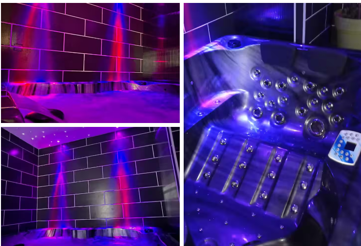

<title> LIVABLOM
<html lang="fr">
<head>
  <meta charset="UTF-8" />
  <meta name="viewport" content="width=device-width, initial-scale=1.0" />
  <title>BLōM - Petit dej offert</title>
  <link href="https://fonts.googleapis.com/css2?family=Montserrat:wght@400;700&display=swap" rel="stylesheet">
  
</head>
<body>
  <header>
    <h1>BLōM – "Petit dej offert"</h1>
    
Maison d'hôte avec spa privatif, salle de massage, lit King Size et petit déjeuner offert

  </header>

  

    
    
    
  

  <section>
    <h2>Le logement</h2>
    
Maison d'hôte avec accès sécurisé par digicode. Au rez-de-chaussée : jacuzzi, salon, salle à manger avec petit frigo et micro-ondes. À l'étage : grande chambre avec lit King Size, salle de massage et salle de douche.

    
Salon avec canapé et TV Netflix. Petit déjeuner offert, servi en toute intimité. Logement non-fumeur (zone fumeurs à l'extérieur).

    
Arrivée et départ en totale autonomie. Jacuzzi vidé et rempli avec vidéo de preuve le jour de votre arrivée.

  </section>

  <section>
    <h2>Infos pratiques</h2>
    <ul>
      <li>Nombre de voyageurs : 2 maximum</li>
      <li>Prix par nuit : 160€</li>
      <li>10 min de Douai et Gayant Expo</li>
      <li>Friterie juste à côté, nombreux restaurants à 5 min</li>
    </ul>
  </section>

  <section>
    <h2>Contact</h2>
    <form action="https://formspree.io/f/moqgdowv" method="POST">
      <input type="text" name="name" placeholder="Votre nom" required>
      <input type="email" name="email" placeholder="Votre e-mail" required>
      <textarea name="message" rows="5" placeholder="Votre message" required></textarea>
      <button type="submit">Envoyer</button>
    </form>
  </section>

  <footer>
    
© 2025 BLōM – Contact : <a href="mailto:livablom59@gmail.com">livablom59@gmail.com</a>

  </footer>
</body>
</html>

💬 Ce que disent nos visiteurs

<section id="avis-clients" style="background-color: #f9f9f9; padding: 40px 20px;">
  

    

      
“Une pépite ! Un hote très sympathique, des instructions claires, une petite maison sur 2 étages, un salon cosy, une table joliment dressée, une salle de massage, un jacuzzi bien chaud, des peignoirs bien pratiques, un lit king size super confortable (dommage qu'on ne pouvait pas le ramener dans la voiture !), un petit déj bien consistant en tête à tête. Rien à redire.”

      
– Emilie, mars 2025

    

    

      
“Tres bon moment passé dans ce logement pour une soiree romantique.
Abdel est un hote tres attentionné et disponible.
Toutes les communications se font par message au long du sejour pour passer un tres bon moment avec de nombreux services.
Le logement est tres propre, le jaccuzzi nettoyé entre chaque locataire. Nous avons été tres contents.
La table est mise pour un diner romantique et le petit dejeuner organisé pour l’intimite des locataires est parfait.
Hote et logement a recommander.”

      
– Melissa, janvier 2025

    

    

      
“Un havre de paix ! On a adoré le lit king size et la vue depuis le salon.”

      
– Sophie, février 2024

    

---

